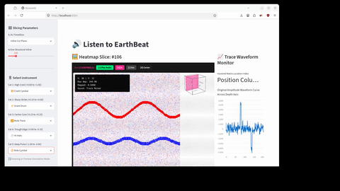

### 💡 Concept & Methodology Credit
The **original concept, methodology, and implementation** of real-time seismic amplitude sonification via web hover interaction was designed and developed by **CHIDANAND BADATYA**. 

*(Note: The software application framework relies on Streamlit under the Apache 2.0 License, making this repository a combined compilation and derivative work.)*

# 📄 Seismic Percussion App

An interactive web application built with Streamlit that converts SEG-Y seismic wave amplitude arrays into audible sound waveforms in real-time.

## 🚀 Installation & Setup

1. **Clone the project repository to your machine:**
   ```bash
   git clone https://github.com
   cd SeismicPercussion
   ```

2. **Install the required dependencies:**
   ```bash
   pip install -r requirements.txt
   ```

3. **Launch the web application locally:**
   ```bash
   python3 -m streamlit run app.py --client.toolbarMode=hidden
   ```

## 🛠️ Requirements
This project runs on Python 3.9+ and relies on the following open-source frameworks:
* `streamlit`
* `numpy`
* `segyio`

## 🛠️ Built With

* [Streamlit](https://streamlit.io) - The open-source data app framework used to build the user interface.
* [Segyio](https://github.com) - Python library for SEGY file interactions.

